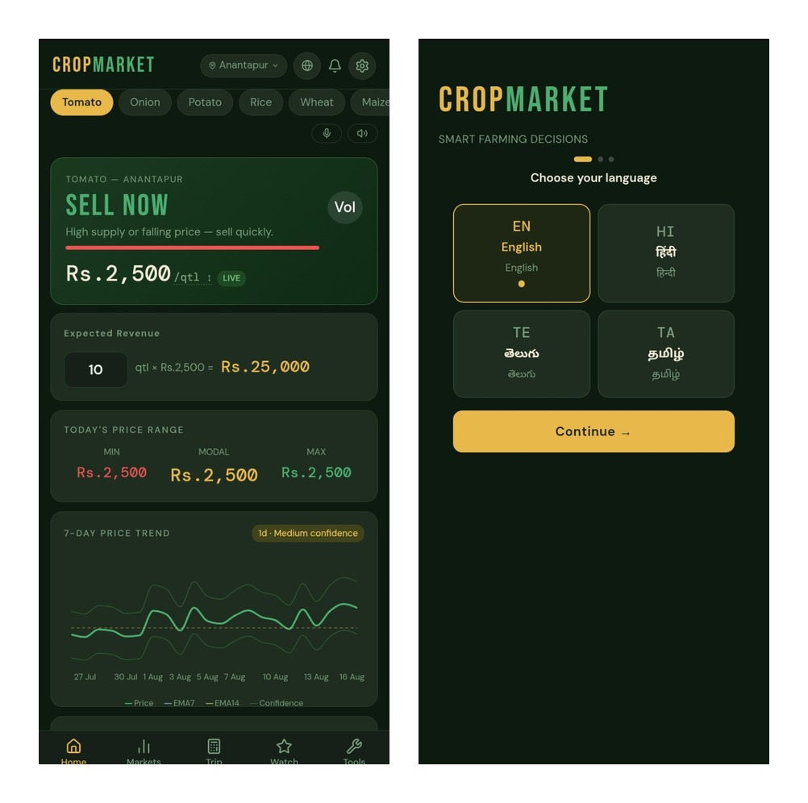

# CropMarket

CropMarket is a browser-based farming decision-support application focused on crop prices, market comparison, weather context, farm calculations, and multilingual or voice-friendly interaction.

**Live demo:** [cropmarketapp.netlify.app](https://cropmarketapp.netlify.app/)



> CropMarket presents estimates and changing information. Verify important prices, weather warnings, government-scheme details, and agricultural guidance against relevant official sources before making real-world decisions.

## What it helps with

CropMarket is organized around a practical question: **where and when should I sell my crop?** The interface combines market-oriented calculations with contextual information such as prices, weather, crop trends, nearby markets, storage considerations, and travel costs.

## Current feature surface

| Area | Included capability |
|---|---|
| Market discovery | Crop search, market views, district/location selection, and nearby-market workflows |
| Decision support | Price and trend presentation, revenue estimates, trip-cost calculations, and profitability views |
| Crop tools | Crop calendar, storage-related guidance, unit conversion, and reference information |
| Accessibility | Responsive browser interaction, multilingual interface support, voice-input hooks, and text-to-speech hooks |
| Planning UI | Watchlist and price-alert interface, weather context, and harvest-risk messaging |

## Architecture

```text
React UI
   ├── location / district selection
   ├── market and crop views
   ├── weather context
   ├── watchlist / alerts
   ├── trip and profitability calculator
   ├── crop tools
   └── voice / language UI

Single application source: cropmarket.jsx
```

## Technology

The current repository is a compact React/JSX application using React hooks, Recharts, Lucide React, and browser location or voice capabilities where supported. It is intentionally lightweight and does not currently expose a conventional package-managed build configuration in the repository.

## Evaluation and local use

The fastest way to evaluate the current build is to open the [live demo](https://cropmarketapp.netlify.app/). The repository contains the application source and a README hero image, but it does not currently include a package manifest. Do not assume that `npm install` or `npm run build` is available until a package configuration is added.

For a local static inspection, open `cropmarket.jsx` using the project’s intended browser or hosting workflow. If this project is moved to a conventional build pipeline, document the exact Node version, install command, build command, and deployment command here.

## Data, privacy, and safety boundaries

Market prices, weather information, government schemes, and recommendations can change over time. A displayed value does not by itself establish that the value is current or official. Before relying on CropMarket for a real decision, verify important information against the relevant official source.

Location and voice features may involve browser permissions. Any future production data layer should document why location is requested, whether it is stored, whether audio leaves the device, which external APIs receive user data, and how API keys are protected.

## Suggested next proof points

The highest-value next additions are calculation fixtures for revenue and trip-cost logic, a documented source and freshness policy for market and weather data, and an explicit status section distinguishing implemented interface features from planned integrations.

## License

See the repository for the applicable source-code license.

## Author

**Mohith Krishnaa** — [@mohith-krishnaa](https://github.com/mohith-krishnaa)
